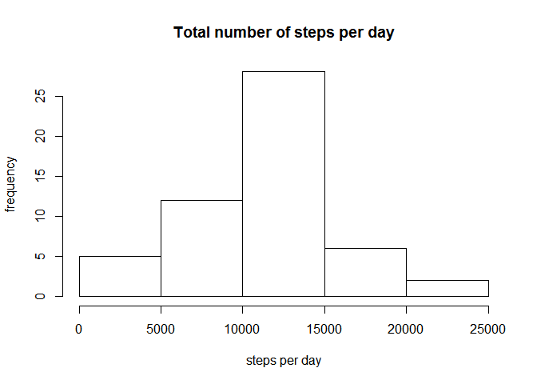
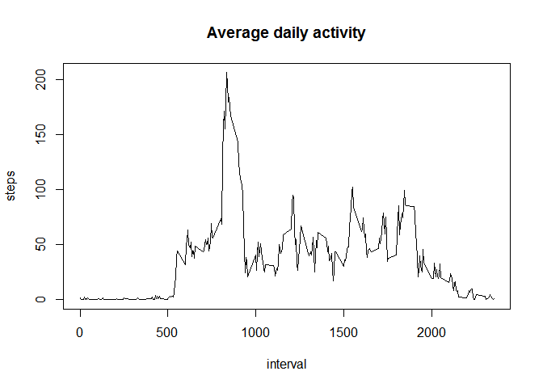
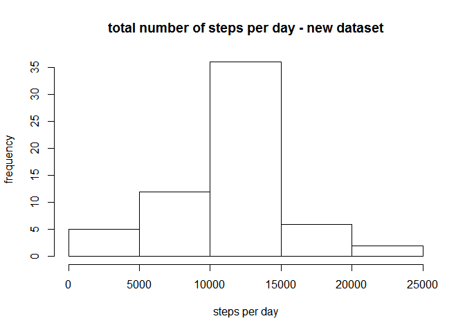
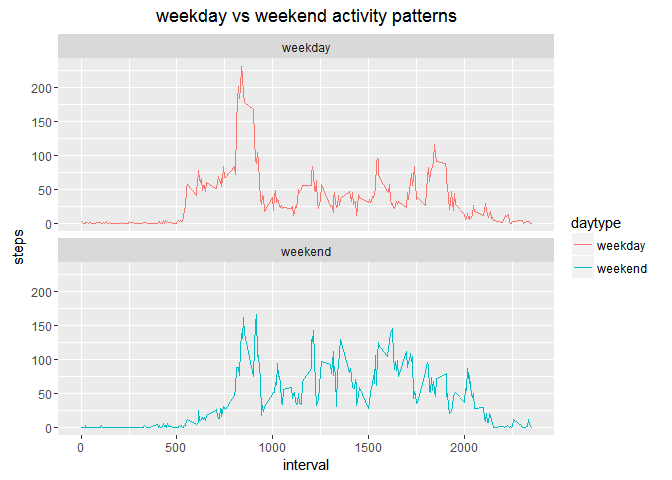

# Reproducible Research: Peer Assessment 1
Petra L. Schoon  
30 March 2016  

# Reproducible Data: Peer-Assessment 1

## Introduction

This document presents the results of the first project assignment of the Coursera Course *Reproducible Research*, which is part of the Data Science specialisation offered by John Hopkins University.  

This assignment makes use of data from a personal activity monitoring device. This device collects data at 5 minute intervals throughout the day. The data consists of two months of data from an anonymous individual collected during the months of October and November, 2012 and include the number of steps taken in 5 minute intervals each day.

The goal of this assignment is to write a single R Markdown file, which is processed by Knitr and transformed to an HTML file. 


## Loading and preprocessing the data

The following code loads the dataset into r from a previously set working directory containing the dataset file. 

```r
data <- read.csv("activity.csv", sep=",")
```

The following preparations are performed so that the dataset can be easily handled for the assignment:

#### 1. loading necesarry r work packages (lubridate, dplyr, ggplot2, knitr)

```r
if (!require("lubridate")) {
      install.packages("lubridate", repos="http://cran.rstudio.com/")
}
```

```
## Loading required package: lubridate
```

```r
require("lubridate")

if (!require("dplyr")) {
      install.packages("dplyr", repos="http://cran.rstudio.com/")
}
```

```
## Loading required package: dplyr
```

```
## 
## Attaching package: 'dplyr'
```

```
## The following objects are masked from 'package:lubridate':
## 
##     intersect, setdiff, union
```

```
## The following objects are masked from 'package:stats':
## 
##     filter, lag
```

```
## The following objects are masked from 'package:base':
## 
##     intersect, setdiff, setequal, union
```

```r
require("dplyr")

if (!require("ggplot2")) {
      install.packages("ggplot2", repos="http://cran.rstudio.com/")
}
```

```
## Loading required package: ggplot2
```

```r
require("ggplot2")

if (!require("knitr")) {
      install.packages("knitr", repos="http://cran.rstudio.com/")
}
```

```
## Loading required package: knitr
```

```r
require("knitr")
```


#### 2. Taking a peak at the data:

```r
head(data)
```

```
##   steps       date interval
## 1    NA 2012-10-01        0
## 2    NA 2012-10-01        5
## 3    NA 2012-10-01       10
## 4    NA 2012-10-01       15
## 5    NA 2012-10-01       20
## 6    NA 2012-10-01       25
```

```r
summary(data)
```

```
##      steps                date          interval     
##  Min.   :  0.00   2012-10-01:  288   Min.   :   0.0  
##  1st Qu.:  0.00   2012-10-02:  288   1st Qu.: 588.8  
##  Median :  0.00   2012-10-03:  288   Median :1177.5  
##  Mean   : 37.38   2012-10-04:  288   Mean   :1177.5  
##  3rd Qu.: 12.00   2012-10-05:  288   3rd Qu.:1766.2  
##  Max.   :806.00   2012-10-06:  288   Max.   :2355.0  
##  NA's   :2304     (Other)   :15840
```


#### 3. Parsing the date into a POSIXct object using lubridate

```r
data$date <- ymd(data$date)
```


#### 4. Converting dataset into a tbl-dataframe for manipulation of the data using dplyr

```r
activity <- tbl_df(data)
```


Now we can start to take a closer look at the data!


## What is the mean total number of steps taken per day?

This part of the assignment consists of 3 parts, in which missing values in the dataset are ignored.


#### Part 1. Calculate the total number of steps taken per day:


```r
steps <- activity %>% 
      select(steps, date) %>%
      group_by(date) %>%
      summarize(steps_sum = sum(steps))
steps
```

```
## Source: local data frame [61 x 2]
## 
##          date steps_sum
##        (time)     (int)
## 1  2012-10-01        NA
## 2  2012-10-02       126
## 3  2012-10-03     11352
## 4  2012-10-04     12116
## 5  2012-10-05     13294
## 6  2012-10-06     15420
## 7  2012-10-07     11015
## 8  2012-10-08        NA
## 9  2012-10-09     12811
## 10 2012-10-10      9900
## ..        ...       ...
```


#### Part 2. Creating a histogram that shows the total number of steps taken per day:


```r
hist(steps$steps_sum, main="Total number of steps per day", xlab="steps per day", ylab="frequency")
```

\

#### Part 3. Calculate the mean and median of the toal number of steps taken per day:


```r
steps_mean <- mean(steps$steps_sum, na.rm=TRUE)
steps_mean                  
```

```
## [1] 10766.19
```

```r
steps_median <- median(steps$steps_sum, na.rm=TRUE)
steps_median
```

```
## [1] 10765
```


## What is the average daily activity pattern?

In this part of the assignment a time series plot is made of the 5-minute interval and the average number of steps taken, averaged across all days.  


```r
Int <- data %>%
      filter(!is.na(steps)) %>%
      group_by(interval) %>%
      summarize(steps = mean(steps))

plot(Int$interval, Int$steps, type="l", main="Average daily activity", xlab="interval", ylab="steps")
```

\


**Question:** Which 5-minute interval, on average across all the days in the dataset, contains the maximum number of steps?
**Answer:**  Interval 835 contains the maximum number of steps with an average total of 206 steps. See code below:

```r
Int[which.max(Int$steps),]
```

```
## Source: local data frame [1 x 2]
## 
##   interval    steps
##      (int)    (dbl)
## 1      835 206.1698
```


## Imputting missing values

There are a number of days/intervals where there are missing values (shown as NA). The presence of these missing values may introduce bias into some of the calculations or summaries of the data. 

We first would like to know the total number of missing values in the dataset.


```r
sum(is.na(data$steps))
```

```
## [1] 2304
```

```r
sum(is.na(data))
```

```
## [1] 2304
```

This means that there are 2304 missing values in the dataset, which are all contained within the *steps* variable.  


Now we will fill all the missing values in the dataset. We will create a new dataset that is equal to the original dataset, but with the missing values replaced by the mean of the 5-minute interval:

```r
activity_new <- data
NAs <- is.na(activity_new$steps)
meanInt <- tapply(activity_new$steps, activity_new$interval, mean, na.rm=TRUE)
activity_new$steps[NAs] <- meanInt[as.character(activity_new$interval[NAs])]

sum(is.na(activity_new$steps))         
```

```
## [1] 0
```

As shown above, this new dataset does not contain any missing values.
Now let's have a closer look at this new dataset and compare it with our original dataset. We will repeat the steps we did before by calculating the total number of steps per day and plotting these results in a histogram: 


```r
steps_new <- activity_new %>% 
      select(steps, date) %>%
      group_by(date) %>%
      summarize(steps_sum = sum(steps))
steps_new
```

```
## Source: local data frame [61 x 2]
## 
##          date steps_sum
##        (time)     (dbl)
## 1  2012-10-01  10766.19
## 2  2012-10-02    126.00
## 3  2012-10-03  11352.00
## 4  2012-10-04  12116.00
## 5  2012-10-05  13294.00
## 6  2012-10-06  15420.00
## 7  2012-10-07  11015.00
## 8  2012-10-08  10766.19
## 9  2012-10-09  12811.00
## 10 2012-10-10   9900.00
## ..        ...       ...
```

```r
hist(steps_new$steps_sum, main="total number of steps per day - new dataset", 
     xlab="steps per day", ylab="frequency")
```

\

Also, we will calculate the mean and median of the total number of steps taken per day from the new dataset:

```r
steps_new_mean <- mean(steps_new$steps_sum)
print(steps_new_mean)                   
```

```
## [1] 10766.19
```

```r
steps_new_median <- median(steps_new$steps_sum)
print(steps_new_median)
```

```
## [1] 10766.19
```

**Questions:** Do these values differ from the estimates from the first part of the assignment? What is the impact of imputting missing data on the estimates of the total daily number of steps?
**Answer:** Imputting the missing values into the dataset only creates a slight difference into the mean (10766 in the old vs 10766 steps per day in the new dataset) and median (10765 in the old vs 10766 steps per day in the new dataset) values. Thus, only the median seems to be affected, and by replacing the missing values by the mean of the 5-minute interval, the mean and median are now equal.  


## Are there differences in activity patterns between weekdays and weekends?

#### Part 1. This code creates a new factor variable in the dataset with the 2 levels indicating whether a given date is a *weekday* or a *weekend* day:
 

```r
daytype <- function(dates) {
      x <- function(date) {
            if(weekdays(date) %in% c("lördag", "söndag")) {     ##  note that the days are denoted in Swedish
                  "weekend"
            }
            else {
                  "weekday"
            }
      }
      sapply(dates, x)
}

activity_new$daytype <- as.factor(daytype(activity_new$date))
str(activity_new)
```

```
## 'data.frame':	17568 obs. of  4 variables:
##  $ steps   : num  1.717 0.3396 0.1321 0.1509 0.0755 ...
##  $ date    : POSIXct, format: "2012-10-01" "2012-10-01" ...
##  $ interval: int  0 5 10 15 20 25 30 35 40 45 ...
##  $ daytype : Factor w/ 2 levels "weekday","weekend": 1 1 1 1 1 1 1 1 1 1 ...
```

```r
head(activity_new)
```

```
##       steps       date interval daytype
## 1 1.7169811 2012-10-01        0 weekday
## 2 0.3396226 2012-10-01        5 weekday
## 3 0.1320755 2012-10-01       10 weekday
## 4 0.1509434 2012-10-01       15 weekday
## 5 0.0754717 2012-10-01       20 weekday
## 6 2.0943396 2012-10-01       25 weekday
```


#### Part 2. This code creates a panel plot containing a time series plot of the 5-minute interval and the average number of steps taken, averaged across all weekdays or weekend days. 
 

```r
Int2 <-activity_new %>%
      group_by(interval, daytype) %>%
      summarize(steps = mean(steps))

plot <- ggplot(Int2, aes(x=interval, y=steps, colour=daytype)) +
      geom_line() +
      facet_wrap(~daytype, ncol=1, nrow=2) +
      labs(title = expression("weekday vs weekend activity patterns")) +
      labs(x = "interval", y = expression("steps"))
print(plot)
```

\


From these two plots we can conclude that the anonymous individual is mainly active in the morning. This is especially so during weekdays compared to the weekend days. During weekend days the activity is more divided throughout the day.
